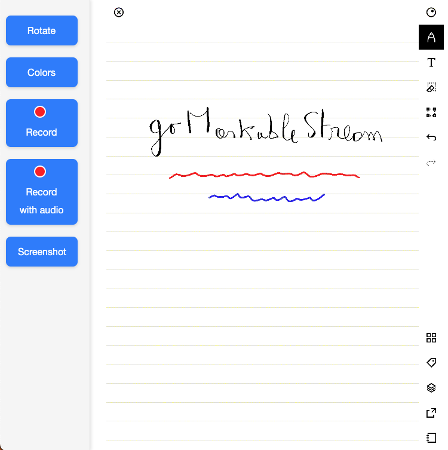
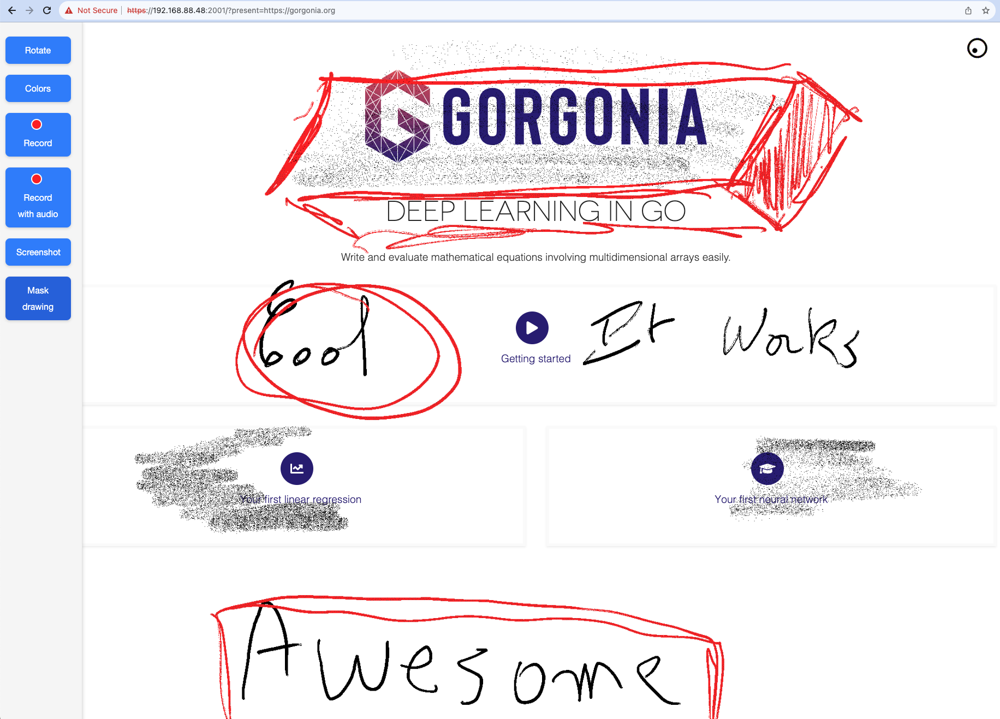

[](https://github.com/owulveryck/goMarkableStream/actions/workflows/go.yml)


# goMarkableStream



## Overview

The goMarkableStream is a lightweight and user-friendly application designed specifically for the reMarkable tablet.

Its primary goal is to enable users to stream their reMarkable tablet screen to a web browser without the need for any hacks or modifications that could void the warranty.

## Version support

- reMarkable with firmware < 3.4 may use goMarkableStream version < 0.8.6
- reMarkable with firmware >= 3.4 and < 3.6 may use version >= 0.8.6 and < 0.11.0
- reMarkable with firmware >= 3.6 may use version >= 0.11.0

## Features

- **No Warranty Voiding**: Operates within the reMarkable tablet's intended functionality without unauthorized modifications.
- **No Subscription Required**: Completely free to use, with no subscription fees or recurring charges.
- **No Client-Side Installation**: Access the screen streaming feature directly through a web browser, with no need for additional software or plugins.
- **Color Support**: Enhanced streaming experience with color support.
- **High Performance**: Utilizes WebGL for smooth and efficient performance.
- **Laser Pointer**: Features a laser pointer that activates on hovering.
- **Gesture Support**: Full integration with Reveal.js, allowing slide switching directly from the reMarkable.
- **Overlay Feature**: Allows overlaying over existing websites that support iframe embedding.
- **Built-in Ngrok**: Enables streaming over different networks easily.
- **Live Parameter Tweaking**: Side menu for live adjustments, including screen rotation.

## Quick Start

```bash
localhost> ssh root@remarkable
```

For version >= 3.6 

```bash
export GORKVERSION=$(wget -q -O - https://api.github.com/repos/owulveryck/goMarkableStream/releases/latest | grep tag_name | awk -F\" '{print $4}')
wget -q -O - https://github.com/owulveryck/goMarkableStream/releases/download/$GORKVERSION/goMarkableStream_${GORKVERSION//v}_linux_arm.tar.gz | tar xzvf - -O goMarkableStream_${GORKVERSION//v}_linux_arm/goMarkableStream > goMarkableStream
chmod +x goMarkableStream
./goMarkableStream
```

for version < 3.6

```bash
export GORKVERSION=$(curl -s https://api.github.com/repos/owulveryck/goMarkableStream/releases/latest | grep tag_name | awk -F\" '{print $4}')
curl -L -s https://github.com/owulveryck/goMarkableStream/releases/download/$GORKVERSION/goMarkableStream_${GORKVERSION//v}_linux_arm.tar.gz | tar xzvf - -O goMarkableStream_${GORKVERSION//v}_linux_arm/goMarkableStream > goMarkableStream
~/chmod +x goMarkableStream
./goMarkableStream
```

then go to [https://remarkable.local.:2001](https://remarkable.local.:2001) and login with `admin`/`password` (can be changed through environment variables or disable authentication with `-unsafe`)

_note_: _remarkable.local._ may work from apple devices (mDNS resolution).
Please note the `.` at the end.
If it does not work, you may need to replace `remarkable.local.` by the IP address of the tablet.

_note 2_: you can use this to update to a new version (ensure that you killed the previous version before with `kill $(pidof goMarkableStream)`)

### Errors due to missing packages

If you get errors such as `wget: note: TLS certificate validation not implemented` or `-sh: curl: command not found` when running through the process above, then some commands are missing on your Remarkable. To avoid having to install additional packages, you can first download goRemarkableStream to your local computer and then copy it over to your Remarkable as follows:

1. Run this on your local computer to download goRemarkableStream into the current directory:

```bash
localhost> export GORKVERSION=$(wget -q -O - https://api.github.com/repos/owulveryck/goMarkableStream/releases/latest | grep tag_name | awk -F\" '{print $4}')
wget -q -O - https://github.com/owulveryck/goMarkableStream/releases/download/$GORKVERSION/goMarkableStream_${GORKVERSION//v}_linux_arm.tar.gz | tar xzvf - -O goMarkableStream_${GORKVERSION//v}_linux_arm/goMarkableStream > goMarkableStream
chmod +x goMarkableStream
```

2. Copy it over to your Remarkable (`remarkable` is the ip of your Remarkable):
```bash
localhost> scp ./goMarkableStream root@remarkable:/home/root/goMarkableStream
```

3. Login into your Remarkable:
```bash
localhost> ssh root@remarkable
```

4. Start goRemarkableStream (to make it permanent, see section about turning goRemakableStream into a systemd service):
```bash
./goRemarkableStream
```


## Setup goMarkableStream as a systemd service

This section explains how to set up goMarkableStream as a system service that will stay running through
device restart and sleep. Note, however, this setup script will need to be executed 
for any reMarkable system update/installation. 

First, we'll write the script, saving it to the home directory. Then, we'll execute the script which performs all
setup necessary to register goMarkableStream as a system service. It can be executed after every system update.
Note, this script assumes the goMarkableStream executable exists in the home directory.

```bash
localhost> ssh root@remarkable
```

Create a bash script under the home directory:
```bash
touch setupGoMarkableStream.sh
chmod +x setupGoMarkableStream.sh
```

Then open the file in nano:
```bash
nano setupGoMarkableStream.sh
```

Finally, paste (ctrl-shift-v) the following into the nano editor. Then save and quit (ctrl-X, Y, [enter]).
```bash
pushd /etc/systemd/system
touch goMarkableStream.service

cat <<EOF>goMarkableStream.service
[Unit]
Description=Go Remarkable Stream Server

[Service]
ExecStart=/home/root/goMarkableStream
Restart=always

[Install]
WantedBy=multi-user.target
EOF

systemctl enable goMarkableStream.service
systemctl start goMarkableStream.service
systemctl status goMarkableStream.service
popd
```

Executing setupGoMarkableStream.sh will register the goMarkableStream executable as a systemd service!

## Configurations

### Device Configuration
Configure the application via environment variables:
- `RK_SERVER_BIND_ADDR`: (String, default: `:2001`) Server bind address.
- `RK_SERVER_USERNAME`: (String, default: `admin`) Username for server access.
- `RK_SERVER_PASSWORD`: (String, default: `password`) Password for server access.
- `RK_HTTPS`: (True/False, default: `true`) Enable or disable HTTPS.
- `RK_COMPRESSION`: (True/False, default: `false`) Enable or disable compression.
- `RK_DEV_MODE`: (True/False, default: `false`) Enable or disable developer mode.

### Endpoint Configuration
Add query parameters to the URL (`?parameter=value&otherparameter=value`):
- `color`: (true/false) Enable or disable color.
- `portrait`: (true/false) Enable or disable portrait mode.
- `rate`: (integer, 100-...) Set the frame rate.

## Tunneling
Tunneling with built-in Ngrok allows for streaming across different networks.
This feature is particularly useful for remote presentations or collaborative sessions.
To set up tunneling, simply enable Ngrok in the tool's settings and follow the instructions provided in the user interface.

If your reMarkable is on a different network than the displaying device, you can use the `ngrok` builtin feature for automatic tunneling.
To utilize this tunneling, you need to sign up for an ngrok account and [obtain a token from the dashboard](https://dashboard.ngrok.com/get-started/your-authtoken).
Once you have the token, launch reMarkable using the following command:

`NGROK_AUTHTOKEN=YOURTOKEN RK_SERVER_BIND_ADDR=ngrok ./goMarkableStream`

The app will start, displaying a message similar to:

`2023/09/29 16:49:20 listening on 72e5-22-159-32-48.ngrok-free.app` 

Then, connect to `https://72e5-22-159-32-48.ngrok-free.app` to view the result.


## Presentation Mode
`goMarkableStream` introduces an innovative experimental feature that allows users to set a presentation or video in the background, enabling live annotations using a reMarkable tablet.
This feature is ideal for enhancing presentations or educational content by allowing dynamic, real-time interaction.

### How It Works

- To use this feature, append `?present=https://url-of-the-embedded-file` to your streaming URL.
- This action will embed your chosen presentation or video in the stream's background.
- You can then annotate or draw on the reMarkable tablet, with your input appearing over the embedded content in the stream.

### Usage Example

- **Live Presentation Enhancement**: For instance, using Google Slides, you can leave spaces in your slides or use a blank slide to write additional content live.
This feature is perfect for educators, presenters, and anyone looking to make their presentations more interactive and engaging.



### Compatibility

- The feature works with any content that can be embedded in an iframe.
This includes a variety of presentation and video platforms.
- Ensure that the content you wish to embed allows iframe integration.

`goMarkableStream` is fully integrated with Reveal.js, making it a perfect tool for presentations.
Switch slides or navigate through your presentation directly from your reMarkable tablet.
This seamless integration enhances the experience of both presenting and viewing, making it ideal for educational and professional environments.

Howto: add the `?present=https://your-reveal-js-presentation`

_note_: due to browser restrictions, the URL mus

### Limitations and Performance

- **Screen Size**: Currently, the drawing screen size on the tablet is smaller than the presentations, which may affect how content is displayed.
- **Control**: There is no way to control the underlying presentation directly from the tablet.
Users must use the side menu for navigation and control.
- This feature operates seamlessly, with no additional load on the reMarkable tablet, as all rendering is done in the client's browser.

### Feedback and Contributions

- As this is an experimental feature, your feedback is crucial for its development.
Please share your experiences, suggestions, and any issues encountered using the GitHub issues section of this repository.

---

## Technical Details

This tool suits my need and is an ongoing development. You can find various informations about the journey on my blog:
- [Streaming the reMarkable 2](https://blog.owulveryck.info/2021/03/30/streaming-the-remarkable-2.html)
- [Evolving the Game: A clientless streaming tool for reMarkable 2](https://blog.owulveryck.info/2023/07/25/evolving-the-game-a-clientless-streaming-tool-for-remarkable-2.html)

### Remarkable HTTP Server

This is a standalone application that runs directly on a Remarkable tablet.
It does not have any dependencies on third-party libraries, making it a completely self-sufficient solution.
This application exposes an HTTP server with two endpoints:
### Endpoints 

- `/`: This endpoint serves an embedded HTML and JavaScript file containing the necessary logic to display an image from the Remarkable tablet on a client's web browser.

- `/stream`: This endpoint streams the image data from the Remarkable tablet to the client continuously.
- `/events`: This endpoint streams the pen input events via websockets
- `gestures`: This endpoints streams the touch events in binary

**Caution**: the API may change over time

### Implementation

The image data is read directly from the main process's memory as a byte array.
A simple Run-Length Encoding (RLE) compression algorithm is applied on the tablet to reduce the amount of data transferred between the tablet and the browser.

The CPU footprint is relatively low, using about 10% of the CPU for a frame every 200 ms.
You can increase the frame rate, but it will consume slightly more CPU.

On the client side, the streamed byte data is decoded and displayed on a canvas by addressing the backend array through WebGL.

Additionally, the application features a side menu which allows users to rotate the displayed image.
All image transformations utilize native browser implementations, providing optimized performance.

## Compilation

```bash
GOOS=linux GOARCH=arm GOARM=7 CGO_ENABLED=0 go build -v -trimpath -ldflags="-s -w" .
```

to install and run, you can then execute:

```bash
scp goMarkableStream root@remarkable:
ssh root@remarkable ./goMarkableStream
```

## Contributing

I welcome contributions from the community to improve and enhance the reMarkable Screen Streaming Tool.
If you have any ideas, bug reports, or feature requests, please submit them through the GitHub repository's issue tracker.

## License

The reMarkable Screen Streaming Tool is released under the [MIT License](https://opensource.org/licenses/MIT) .
Feel free to modify, distribute, and use the tool in accordance with the terms of the license.

## Tipping

If you plan to buy a reMarkable 2, you can use my [referal program link](https://remarkable.com/referral/PY5B-PH8U).
It will provide a discount for you and also for me.

