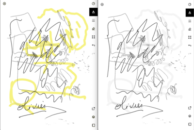

[](https://github.com/owulveryck/goMarkableStream/actions/workflows/go.yml)

# goMarkableStream

I use this  project to stream my remarkable 2 (firmware 2.5+) on my laptop using the local wifi.
This project does not need any hack installed on the remarkable (only the server which should not void the warranty).
This project does not rely on any exterrnal dependencies and should run on Linux, Windows and. MacOS.

[video that shows some features](https://www.youtube.com/watch?v=PzlQ2hEIdCc)

And [another one](https://youtu.be/0PCyUn_-x6Y) that shows the experimental colorize featur

## Quick start

You need ssh access to your remarkable

Download two files from the [release page](https://github.com/owulveryck/goMarkableStream/releases):

- the server "`Linux/Armv7`" for your remarkable
- the client for your laptop according to the couple `OS/arch`

or build it yourself if you have the go toolchain installed on your machine.

### The server

Copy the server on the remarkable and start it.

```shell
scp goMarkableStreamServer.arm remarkable:
ssh remarkable './goMarkableStreamServer.arm'
```

Note: The processus is fault tolerant and should resume automatically on sleep/wakup or network failure; therefore, you can, normally, launch the processus in background (with `nohup`)


### The client

- Start the client: `RK_SERVER_ADDR=ip.of.remarkable:2000 ./goMarkableClient`

- Point your browser to [`http://localhost:8080/`](http://localhost:8080/)

Note: click on the video to take a screenshot. The screenshot is a png file with transparent background.

_Note_: there is also an experimental (and ugly) [/conf`](http://localhost:8080/conf) endpoint to activate some features on the fly.

### Configuration

It is possible to tweak the configuration via environment variables:

#### Server

| Env var             |  Default  |  Descri[ption
|---------------------|-----------|---------------
| RK_SERVER_BIND_ADDR | :2000     | the TCP listen address

#### Client

| Env var                   |  Default        |  Descri[ption
|---------------------------|-----------------|---------------
| RK_CLIENT_BIND_ADDR       | :8080           | the TCP listen address
| RK_SERVER_ADDR            | remarkabke:2000 | the address of the remarkable
| RK_CLIENT_AUTOROTATE      | true            | activate autorotate (see below)
| RK_CLIENT_PAPER_TEXTURE   | null            | a path to a texture
| RK_CLIENT_COLORIZE        | true           | colorize function
| RK_CLIENT_HIGHLIGHT        | false           | highlight function (cannot work with colorize)

## Features

### Auto-rotate

The client tries to locate the location of the top level switch on the picture (the round one) and rotate the picture accordingly.
This experimental behavior can be disabled by env variables in the client.

Note: the browser does not like the switch of the rotation; the reload of the page solves the problem

### Texture

There is an experimental texture feature that reads a texture file and use is as a background in the output. The texture does
not apply to the screenshot.
The texture must have this format:

```shell
> identify textures/oldpaper.png
textures/oldpaper.png PNG 1872x1404 1872x1404+0+0 8-bit Gray 256c 886691B 0.010u 0:00.001
```

Example:

```shell
RK_CLIENT_PAPER_TEXTURE=./textures/oldpaper.png goMarkableClient
```


### Colorize

This option can be activated with the `RK_CLIENT_COLORIZE=true` env variable. This tries to set the highlighter and colors in yellow in the video stream. 

**Caution** This is CPU intensive.



### Screenshot

The server is exposing a screenshot endpoint. You can grab a screenshot by clicking on the video stream, or by using tools such as curl:

ex: 
```shell
❯ curl -o /tmp/screenshot.png http://localhost:8080/screenshot
❯ file /tmp/screenshot.png
/tmp/screenshot.png: PNG image data, 1404 x 1872, 8-bit/color RGBA, non-interlaced
```

### Raw picture

the `/raw` endpoind exposes the raw picture without any treatment. It is possible to pipe the result into a thrid party tool such as imageMagick for example.

This generates a pdf from the screen
```shell
curl http://localhost:8080/raw | convert -depth 8 -size 1404x1872+0 gray:- shot.pdf
```

## How it works?

### Full explanation

I wrote a [blog post](https://blog.owulveryck.info/2021/03/30/streaming-the-remarkable-2.html) that explains all the wiring.
Otherwise a summary is written here.

### The server loop

- The server gets the address of the framebuffer in the memory space of the `xochitl`
- The server launches a "ticketing system" to avoid congestion. The ticketing system is a channel that gets an event every 200ms.
- Then it exposes a gRPC function (with TLS and mutual authentication).
- The gRPC function waits for a "ticket" on the channel, and then grabs the data from the framebuffer.
- It packs the data into an `image` message encoded in protobuf and sends it to the consumer

### The client loop

- The client creates an `MJPEG` stream and serves it over HTTP on the provided address
- The client dial server and sends its certificate, and add the compression header.
- Then it triggers a goroutine to get the `image` in a for loop.
- The image is then encoded into JPEG format and added to the MJPEG stream.


## Security

The communication is using TLS. The client and the server owns an embedded certificate chain (with the CA). There are performing mutual authentication.
A new certificate chain is generated per build. Therefore, if you want restrict the access to your server to your client only, you must rebuild the tool yourself.

### Manual build

_Note_: you need go > 1.16beta to build the tool because of the embedding mechanism for the certificate.

To build the tool manually, the easiest way is to use `goreleaser`:

```shell
goreleaser --snapshot --skip-publish --rm-dist
```

To build the services manually:

```shell
go generate ./... # This generates the certificates
cd server && GOOS=linux GOARCH=arm GOARM=7 go build -o goStreamServer.arm
cd client && go build -o goStreamClient
```

# Tipping

If you plan to buy a reMarkable 2, you can use my [referal program link](https://remarkable.com/referral/PY5B-PH8U). It will provide a discount for you and also for me.

## Acknowledgement

All the people in the reStream projet and specially
[@ddvk](https://github.com/ddvk) and [@raisjn](https://github.com/raisjn)
